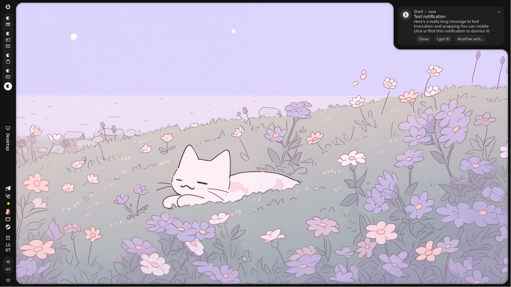
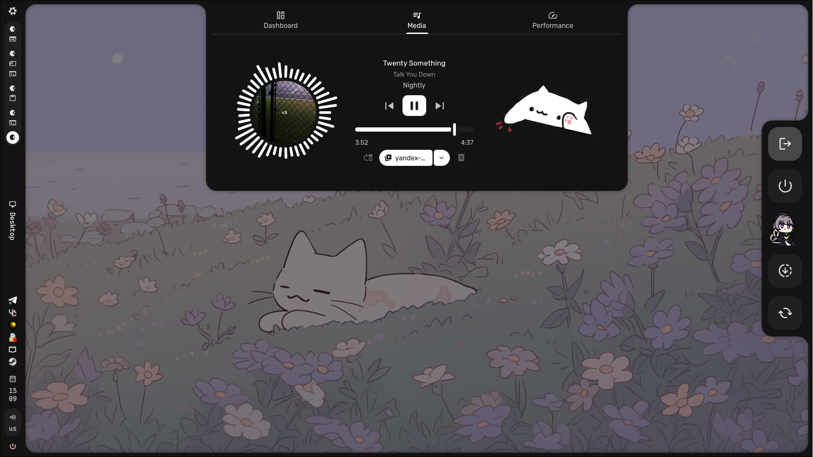
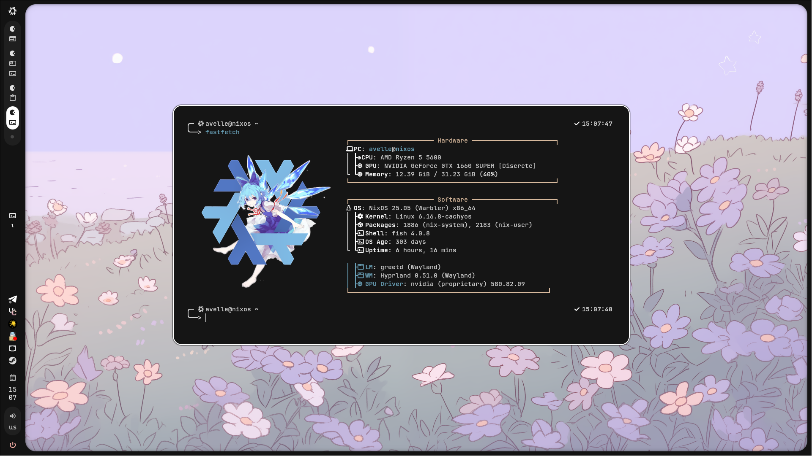
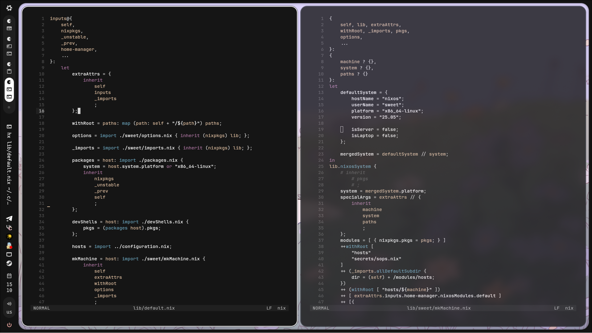

<div align="center"></div>

<h1 align="center">✨ NixOS Sweet Configuration ✨</h1>
<p align="center" style="text-decoration:none;">
	<a href="https://github.com/Av3lle/NixOS_sweetConfiguration" style="text-decoration:none;">
		
	</a>
	<a href="https://github.com/NixOS/nixpkgs/tree/nixos-25.05" style="text-decoration:none;">
		
	</a>
	<a href="https://wiki.nixos.org/wiki/Flakes" style="text-decoration:none;">
		
	</a>
</p>

Моя конфигурация NixOS + Home Manager, которая будет постепенно улучшаться и настроенная под личные предпочтения, и эстетические вкусы.

---

## 📋 Содержание

- [Особенности](#-особенности)  
- [Структура репозитория](#-структура-репозитория)  
- [Превью рабочего стола](#-превью-рабочего-стола)  
- [Используемое ПО](#-используемое-по)  
- [Установка / Использование](#-установка--использование)  
- [Благодарности](#-благодарности)

---

## ✨ Особенности

- Использование **Flakes** для декларативного управления конфигурацией.  
- Настройка через **Home Manager** для пользовательских программ.  
- Много различных модулей на вкус и цвет.  
- Возможность легкого расширения под новые машины или окружения.  
- Caelestia-shell из коробки.

---

## 📂 Структура репозитория

- [flake.nix](flake.nix) – основной flake-файл  
- [configuration.nix](configuration.nix) – параметры для хоста
- [lib](lib/) – самописная библиотека 
- [hosts](hosts/) – каталог с хостами
- [home](home/) - каталог с пользователями
- [modules](modules/) - все модули
	- [hosts](modules/hosts/) - модули предназначенные для хоста
	- [home](modules/home/) - модули предназначенные для пользователя
- [derivations](derivations/) - собственные пакеты

> Путь и названия могут немного отличаться, т.к. их слишком много.

---

## 🖼 Превью рабочего стола

<p align="center">
  
</p>
<p align="center">
  
</p>
<p align="center">
  
</p>
<p align="center">
  
</p>

---

## 🖥 Используемое ПО

| Категория        | Используемый софт / инструменты |
| ---------------- | ------------------------------- |
| ОC / менеджмент  | NixOS, Flakes                   |
| Конфиги юзера    | Home Manager                    |
| Композитор       | Hyprland                        |
| Тема / стиль     | Custom base16 theme             |
| Панели / виджеты | Caelestia-shell                 |
| Терминал / шелл  | Kitty + fish + starship         |
| Редактор         | Helix                           |

---

## 🚀 Установка / Использование

> ⚠️ **Внимание**: этот конфиг адаптирован под моё железо и предпочтения. Используй на свой страх и риск.

```bash
git clone https://github.com/Av3lle/NixOS_sweetConfiguration.git
cd NixOS_sweetConfiguration

# Применяем конфигурацию (для конкретного хоста)
sudo nixos-rebuild switch --flake .#pc
sudo home-manager switch --flake .#pc
```

---

## ❤️ Благодарности

- Репозитории и конфиги сообщества NixOS, за вдохновение
    
- [Лабубу](https://git.sr.ht/~neverness/multi-flake)
- [TheMaxMur](https://github.com/TheMaxMur/NixOS-Configuration/tree/master)
    
- Ты (да, ты!) — если смотришь это, спасибо за интерес 😊